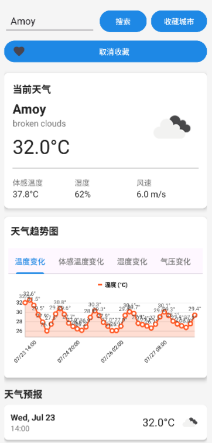

#  WeatherReportofYou (WRY)

<div align="center">


**一个功能丰富的 Android 天气应用，提供实时天气信息、天气预报和数据可视化等**

[安装指南](#-安装指南)• [API 文档](docs/API.md) • [贡献](#-贡献)

</div>

---

## 目录

- [WeatherReportofYou (WRY)](#weatherreportofyou-wry)
  - [目录](#目录)
  - [🚀 安装指南](#-安装指南)
    - [开发环境要求](#开发环境要求)
    - [安装步骤](#安装步骤)
  - [🎯 核心功能](#-核心功能)
    - [天气查询](#天气查询)
    - [收藏管理](#收藏管理)
  - [📊 数据可视化](#-数据可视化)
  - [🔧 配置说明](#-配置说明)
    - [API 密钥安全管理](#api-密钥安全管理)
    - [网络配置](#网络配置)
  - [📱 应用截图](#-应用截图)
  - [🚀 部署](#-部署)
    - [Debug 版本](#debug-版本)
    - [Release 版本](#release-版本)
  - [🤝 贡献](#-贡献)
    - [🐛 问题报告](#-问题报告)
  - [📝 版本控制](#-版本控制)
    - [版本号规则](#版本号规则)
  - [👨‍💻 作者](#-作者)
  - [📄 版权说明](#-版权说明)
  - [致谢](#致谢)

## 🚀 安装指南

###  开发环境要求

- **Android Studio** Arctic Fox 或更高版本
- **JDK 11** 或更高版本
- **Android SDK** API 24+ (Android 7.0)
- **Gradle 8.0+**

###  安装步骤

1. **克隆项目**
   ```bash
   git clone https://github.com/Sakurapainting/WeatherReportofYou.git
   cd WeatherReportofYou
   ```

2. **配置 API Key** 
   
   - 访问 [OpenWeatherMap](https://openweathermap.org/api) 注册并获取免费的 API key
   - 在项目根目录的 `local.properties` 文件中添加你的 API key：
   
   ```properties
   # local.properties
   WEATHER_API_KEY=你的API密钥
   ```
   
   或者设置环境变量：
   ```bash
   # Windows
   set WEATHER_API_KEY=你的API密钥
   
   # Linux/macOS
   export WEATHER_API_KEY=你的API密钥
   ```

3. **编译运行项目** 
   ```bash
   ./gradlew assembleDebug
   ```
   或在 Android Studio 中直接运行

## 🎯 核心功能

###  天气查询
- 支持全球城市搜索
- 实时天气数据获取

###  收藏管理
- 添加/删除收藏城市
- 收藏列表快速访问
- 本地数据库存储


## 📊 数据可视化

使用 **MPAndroidChart** 库实现：
-  温度变化趋势图
-  湿度变化柱状图
-  风速变化曲线

## 🔧 配置说明

### API 密钥安全管理
项目使用 Gradle BuildConfig 在编译时自动注入 API 密钥，确保：
-  源码中不包含敏感信息
-  支持环境变量和配置文件两种方式
-  自动验证 API 密钥有效性

### 网络配置
- 使用 Retrofit + OkHttp 进行网络请求
- 支持请求日志记录
- 自动重试机制

## 📱 应用截图



## 🚀 部署

### Debug 版本
```bash
./gradlew assembleDebug
```

### Release 版本
```bash
./gradlew assembleRelease
```

生成的 APK 文件位于：`app/build/outputs/apk/`


## 🤝 贡献

我们欢迎所有形式的贡献！无论是新功能、bug 修复、文档改进还是其他建议。
[贡献文档](.github/CONTRIBUTING.md)

### 🐛 问题报告
发现 bug？请通过 [Issues](https://github.com/Sakurapainting/WeatherReportofYou/issues) 报告。
[Bug Issue 模版](.github/ISSUE_TEMPLATE/bug_report.md)
[Feature request 模版](.github/ISSUE_TEMPLATE/feature_request.md)

## 📝 版本控制

该项目使用 **Git** 进行版本管理。您可以在 [Releases](https://github.com/Sakurapainting/WeatherReportofYou/releases) 页面查看当前可用版本。

### 版本号规则
- 主版本号：不兼容的 API 修改
- 次版本号：向下兼容的功能性新增
- 修订号：向下兼容的问题修正

## 👨‍💻 作者

**开发者信息**
-  邮箱：you2899047197@163.com
-  GitHub：[@Sakurapainting](https://github.com/Sakurapainting)

## 📄 版权说明

本项目采用 AGPL v3 许可证 - 查看 [LICENSE](LICENSE) 文件了解详情

```
GNU AFFERO GENERAL PUBLIC LICENSE
Version 3, 19 November 2007

Copyright (C) 2025 Sakurapainting

This program is free software: you can redistribute it and/or modify
it under the terms of the GNU Affero General Public License as published
by the Free Software Foundation, either version 3 of the License, or
(at your option) any later version.
```

 ## 致谢

感谢以下开源项目和服务：

   [**Retrofit**](https://square.github.io/retrofit/) - HTTP 客户端库
   [**MPAndroidChart**](https://github.com/PhilJay/MPAndroidChart) - Android 图表库
   [**Glide**](https://github.com/bumptech/glide) - 图片加载库

---

<div align="center">

**⭐ 如果这个项目对你有帮助，请给个 Star！⭐**

**Made with ❤️ by [Sakurapainting](https://github.com/Sakurapainting)**

</div>


